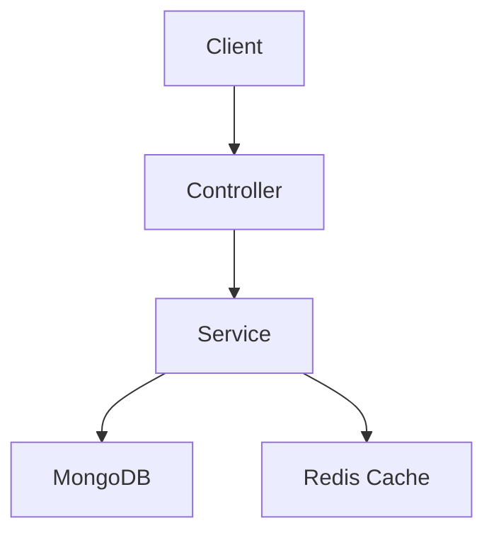

# Architecture Review & ADR — WeWatch

Use for: design reviews before major refactors, documenting key decisions, evaluating new service integrations.

## Design Review Protocol

### 1. Map the component boundaries
```
Entry points:    API routes, Socket.io events, Bull jobs, Firebase webhooks
Internal:        Services, repositories, middleware, utils
External deps:   MongoDB, Redis, Elasticsearch, Firebase, external APIs
Data flow:       Input → validation → service → DB → response
```

### 2. Evaluate design principles

| Principle | Check |
|-----------|-------|
| Single Responsibility | Does each module have ONE clear purpose? |
| Dependency Direction | Do deps flow inward? Controller → Service → Repository |
| Interface Segregation | Are types minimal and focused? |
| Error Handling | Consistent pattern (global handler, not nested try/catch)? |
| Testability | Can service be unit-tested without DB? |

### 3. WeWatch-Specific Anti-Patterns to Catch

```
❌ Business logic in Controller (should be in Service)
❌ DB queries in Controller (should be in Service/Repository)
❌ console.log instead of logger
❌ Socket.io event data used without Joi/Zod validation
❌ userId taken from request body (should be from JWT)
❌ Hardcoded config values (should be from env)
❌ Missing rate limiting on public endpoints
❌ Any type in TypeScript
❌ Multi-service orchestration in a single service (should use events/Bull)
```

### 4. Scalability check
- Can this handle 10x current load?
- Is Redis used appropriately (cache, not primary store)?
- Are Elasticsearch queries optimized (no full scans)?
- Are Socket.io rooms isolated properly for Watch Party?

### 5. Output Format

```markdown
## Architecture Review: <Component>

### Score: 4/5

### Strengths
- Service/Controller separation clean
- Validation at all boundaries

### Critical Issues
- CRITICAL: userId taken from req.body at services/auth/src/routes.ts:45

### Recommendations
1. Move roomValidation to Joi schema (watch-party/src/validators/room.ts)
2. Extract notification logic to notification service (Bull queue)

### Architecture Diagram
[Mermaid diagram]


---

## ADR (Architecture Decision Record)

Use when making a significant technical choice that future developers should understand.

### When to Write an ADR

- Choosing between 2+ technologies (Redis vs Memcached, MongoDB vs Postgres)
- Changing a core pattern (REST → GraphQL, polling → WebSocket)
- Adding a new external dependency
- Making a performance trade-off
- Departing from existing patterns

### ADR Template

```markdown
# ADR-NNNN: <Title>

**Status**: Proposed | Accepted | Deprecated | Superseded by ADR-XXXX
**Date**: YYYY-MM-DD
**Author**: Saidazim | Emirhan

## Context
What problem are we solving? What constraints exist?
(Be factual, no opinion here)

## Decision
What are we doing and why?

## Options Considered
1. **Option A**: Description — Pro: ... Con: ...
2. **Option B**: Description — Pro: ... Con: ...
3. **Chosen: Option C**: Description — Reason: ...

## Consequences

### Positive
- Benefit

### Negative  
- Trade-off

### Risks
- Risk with mitigation
```

ADRs live in: `docs/adr/NNNN-slug.md`

### WeWatch Existing Decisions (Reference)
- Socket.io for Watch Party sync (vs WebRTC) — low latency, server-authoritative sync
- MongoDB Atlas (vs self-hosted) — managed, geo-replication, no ops overhead
- Redis 7 for cache + Bull queues — unified cache + async job layer
- Elasticsearch for content search — full-text + filters + relevance scoring
- Firebase FCM for push notifications — cross-platform, reliable delivery

---

## Running

```bash
/architecture-review services/watch-party     # review module
/architecture-review "use Redis for sessions" # write ADR
```
