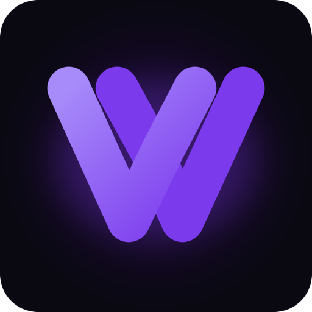

<div align="center">
  

  # WeWatch — Watch Together, Anywhere

  **Social online cinema: watch YouTube, VK, Rutube, and 10+ other sources in perfect sync with friends, in real time.**

  Watch Party live sync · Direct messages · Friends · Telegram & Google auth · Web, Android and iOS clients

  [Website](https://wewatch.uz) · [Web App](https://app.wewatch.uz)

  
  
  
  
  
  
</div>

---

## What is WeWatch?

WeWatch lets you start a room, drop in a video link, and watch it together with friends — playback stays in sync for everyone, with live chat, reactions, and voice alongside the video. Built by **Tezcode** (Tashkent, Uzbekistan).

**Key features:**

- **Watch Party** — real-time synchronized playback (play/pause/seek) across every viewer in a room, with heartbeat-based drift correction
- **Universal video extraction** — YouTube (official embed), VK, Rutube, Twitch, Vimeo, TikTok, and more, via a dedicated extraction pipeline with an HLS proxy for CDN-restricted streams
- **Direct messages** — Telegram-style chat: replies, forwarding, mute/pin conversations, pinned messages, read receipts, realtime delivery over Socket.io
- **Friends & social graph** — friend requests, profiles, presence
- **Auth** — email/password, Google OAuth, Telegram OAuth
- **Push & email** — Firebase Cloud Messaging push notifications, transactional and campaign email
- **Admin panel** — moderation, app settings, room and account management

## Tech Stack

| Service / App | Tech | Port |
|---|---|---|
| `services/auth` | Node.js + Express + MongoDB | 3001 |
| `services/user` | Node.js + Express + MongoDB | 3002 |
| `services/content` | Node.js + Express + Elasticsearch | 3003 |
| `services/watch-party` | Express + Socket.io + Redis | 3004 |
| `services/notification` | Express + Firebase FCM + Bull | 3007 |
| `services/admin` | Express + MongoDB | 3008 |
| `services/payment` | Express + MongoDB — tezcode-billing bridge | 3009 |
| `apps/mobile` | React Native + Expo (Android + iOS) | — |
| `apps/web` | Next.js — marketing site (wewatch.uz) | — |
| `apps/app-web` | Next.js — web app (app.wewatch.uz) | — |
| `apps/admin-ui` | React + Vite admin dashboard | 5173 |
| **Database** | MongoDB Atlas | — |
| **Cache / pub-sub** | Redis 7 | — |
| **Search** | Elasticsearch | — |

**Monorepo:** npm workspaces (`services/*`, `apps/*`, `shared`).

## Architecture

```
Node.js microservices, each independently deployable to Railway.

  apps/mobile, apps/web, apps/app-web, apps/admin-ui
              │
              │  (each client calls every service's own Railway URL directly —
              │   no shared API gateway)
   ┌──────┬───┴────┬───────────┬──────────────┬───────┐
   ▼      ▼        ▼           ▼              ▼       ▼
 auth   user    content   watch-party   notification admin
                            │
                      Socket.io + Redis
                   (realtime sync, DMs, presence)
```

`shared/` holds types, constants (incl. Socket.io event names), and utils used by every service — changes there are cross-cutting and reviewed accordingly.

## Prerequisites

- Node.js ≥ 20, npm ≥ 10
- Docker + Docker Compose
- MongoDB Atlas cluster
- Redis 7
- Elasticsearch

## Local Development

```bash
npm install
cp services/auth/.env.example services/auth/.env
# (repeat for each service)
npm run docker:dev        # MongoDB + Redis + Elasticsearch via Docker
npm run dev:auth          # start an individual service
```

## Production

```bash
docker compose -f docker-compose.prod.yml up -d --build
```

Services deploy to Railway via GitHub Actions on push to `main` (`.github/workflows/deploy-prod.yml`), gated by a typecheck/test pass. See `DR-PLAN.md` for backup and disaster recovery.

## Environment Variables

Each service has its own `.env.example`. Required across all services:

- `MONGO_URI` — MongoDB Atlas connection string
- `REDIS_URL` — Redis connection string
- `JWT_SECRET` / `JWT_REFRESH_SECRET` — signing keys
- `SENTRY_DSN` — error monitoring (optional, disables Sentry if absent)

## Testing

```bash
npm run test:api     # Playwright API tests (all services)
npm run test:smoke   # @smoke tagged tests only
npm run test:report  # open HTML report
```

## Backup

Daily MongoDB backup to S3/R2 via GitHub Actions (`.github/workflows/backup.yml`). Recovery procedure: see `DR-PLAN.md`.

## Docs

- [`CLAUDE.md`](CLAUDE.md) — development conventions and task tracking
- [`DR-PLAN.md`](DR-PLAN.md) — disaster recovery plan
- [`docs/Tasks.md`](docs/Tasks.md) — open tasks
- [`docs/Done.md`](docs/Done.md) — completed tasks

---

<div align="center">Built by <strong>Tezcode</strong> — Tashkent, Uzbekistan</div>
